# P3 – Seguridad de Redes | Infraestructura 1

Implementación de una infraestructura segmentada y protegida mediante **FortiGate 7.0.3**, **Cisco IOSvL2**, **VLANs**, una **DMZ** y políticas de control de acceso entre usuarios, servidores e Internet.

> **Asignatura:** Seguridad de Redes  
> **Proyecto:** P3  
> **Infraestructura:** 1  
> **Matrícula:** 2025-1331

---

## 🎥 Video de demostración

▶️ [Ver video de demostración de la Infraestructura 1](https://youtu.be/D7PI3ZJBzGU)

---

## 🧭 Objetivo

Diseñar e implementar una infraestructura de red con segmentación lógica y controles de seguridad que permita:

- Separar usuarios restringidos y privilegiados mediante VLANs.
- Alojar servidores críticos dentro de una DMZ.
- Impedir fugas de tráfico desde la DMZ hacia las LAN.
- Restringir el acceso de VLAN10 al servidor de inventario.
- Permitir acceso SSH a los servidores únicamente desde VLAN20.
- Restringir el acceso general a Internet desde la DMZ.
- Permitir únicamente DNS y los endpoints necesarios para actualizaciones Debian.
- Aplicar hardening básico en el switch de acceso.

---

## 🏗️ Topología

La infraestructura utiliza **FortiGate**, un **switch Cisco IOSvL2**, dos VLAN de usuarios, tres servidores en DMZ y clientes de prueba ejecutados dentro del laboratorio GNS3/Proxmox.

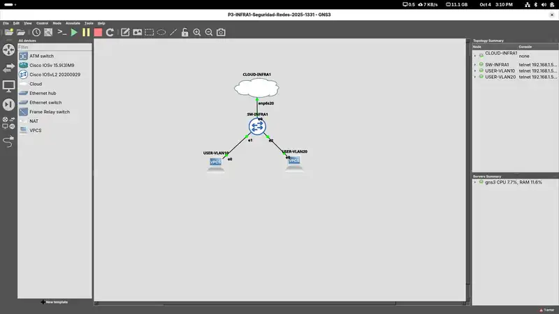

---

## 🌐 Plan de direccionamiento

| Segmento | Red | Gateway | Uso |
|---|---|---|---|
| VLAN10 | `10.31.10.0/25` | `10.31.10.1` | Usuarios restringidos |
| VLAN20 | `10.31.20.0/25` | `10.31.20.1` | Usuarios privilegiados |
| DMZ | `10.31.30.0/28` | `10.31.30.1` | Servidores |

### Servidores DMZ

| Servidor | Dirección IP | Función |
|---|---:|---|
| INFRA1-WEB-CAJA | `10.31.30.2` | Servidor web de Caja |
| INFRA1-WEB-INVENTARIO | `10.31.30.3` | Servidor web de Inventario |
| INFRA1-DB01 | `10.31.30.4` | Servidor de base de datos MariaDB |

---

## 🔥 FortiGate

### Interfaces y segmentación

- **WAN-MGMT / port1:** administración y salida WAN.
- **VLAN10-USERS:** VLAN ID 10 — `10.31.10.1/25`.
- **VLAN20-ADMIN:** VLAN ID 20 — `10.31.20.1/25`.
- **P3-INFRA1-DMZ / port3:** `10.31.30.1/28`.

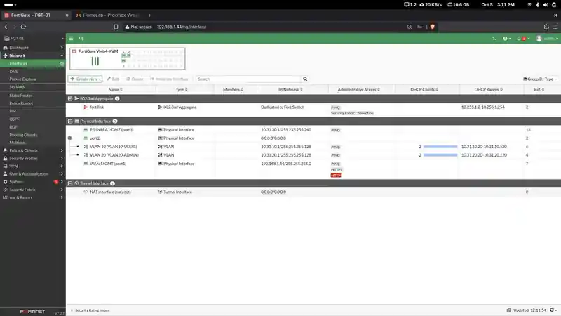

### Objetos de red

Se crearon objetos para los hosts de la DMZ, la red DMZ, DNS autorizado, repositorios Debian y el grupo de servidores.

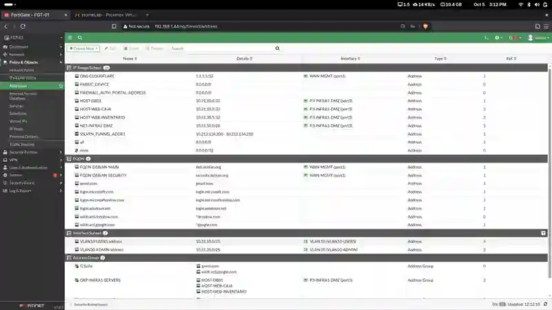

### DHCP

FortiGate entrega direccionamiento dinámico a las dos VLAN:

- VLAN10: `10.31.10.20 - 10.31.10.120`
- VLAN20: `10.31.20.20 - 10.31.20.120`

---

## 🛡️ Políticas de firewall

### DMZ → Internet

| Política | Acción | Propósito |
|---|---|---|
| `DMZ-ALLOW-DNS` | ACCEPT | Permitir DNS hacia Cloudflare |
| `DMZ-ALLOW-DEBIAN-UPDATES` | ACCEPT | Permitir actualizaciones de Debian |
| `DMZ-DENY-INTERNET` | DENY | Bloquear el resto del acceso a Internet |

### DMZ → LAN

| Política | Acción |
|---|---|
| `DMZ-DENY-VLAN10` | DENY |
| `DMZ-DENY-VLAN20` | DENY |

Estas reglas evitan que los servidores de la DMZ puedan iniciar tráfico hacia las redes internas.

### VLAN10 → DMZ

| Política | Resultado |
|---|---|
| `VLAN10-ALLOW-CAJA` | Permite HTTP/HTTPS hacia WEB-CAJA |
| `VLAN10-DENY-INVENTARIO` | Bloquea HTTP/HTTPS hacia WEB-INVENTARIO |
| `VLAN10-DENY-SSH` | Bloquea SSH hacia los servidores |

### VLAN20 → DMZ

| Política | Resultado |
|---|---|
| `VLAN20-ALLOW-SSH` | Permite SSH hacia los tres servidores de la DMZ |

### Vista final de políticas

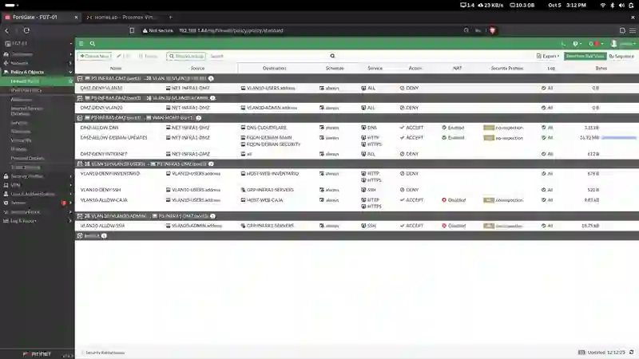

---

## 🔀 Switch Cisco – SW-INFRA1

### VLANs

| VLAN | Nombre | Puertos |
|---:|---|---|
| 10 | `USERS-RESTRICTED` | Gi0/1 |
| 20 | `USERS-PRIVILEGED` | Gi0/2, Gi0/3 |
| 999 | `UNUSED_PORTS` | Gi1/0 - Gi1/3 |

### Trunk

- **Gi0/0**
- Encapsulación **802.1Q**
- VLAN permitidas: **10,20**

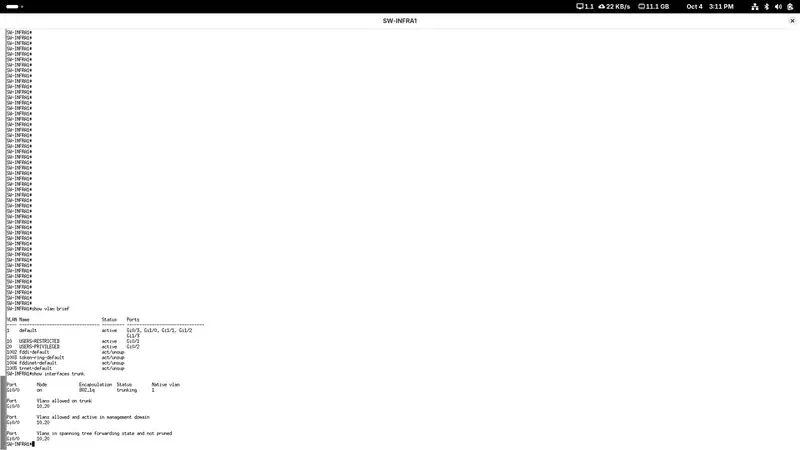

### Hardening aplicado

- PortFast en puertos de acceso.
- BPDU Guard en puertos de acceso.
- Port-Security con máximo de 1 dirección MAC.
- Modo de violación `restrict`.
- Puertos sin uso asignados a VLAN999.
- Puertos sin uso administrativamente apagados.

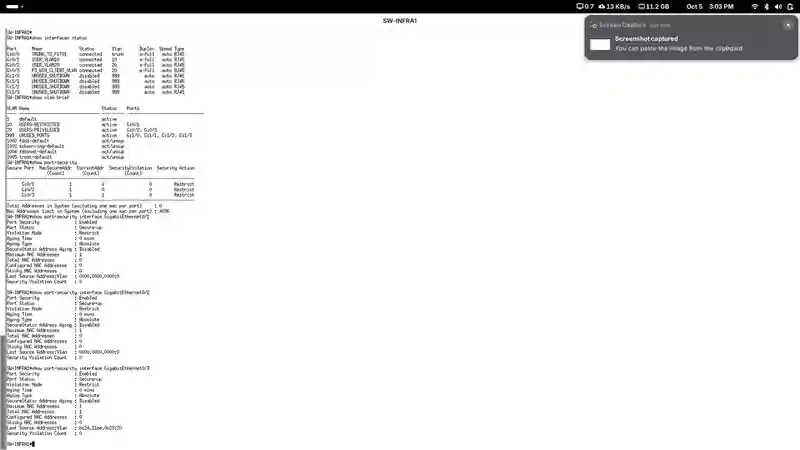

La configuración completa se encuentra en:

[`configs/SW-INFRA1-running-config.txt`](configs/SW-INFRA1-running-config.txt)

---

## 🧪 Pruebas realizadas

### VLAN10 – USERS-RESTRICTED

Cliente de pruebas: `10.31.10.21/25`.

#### Acceso permitido a WEB-CAJA

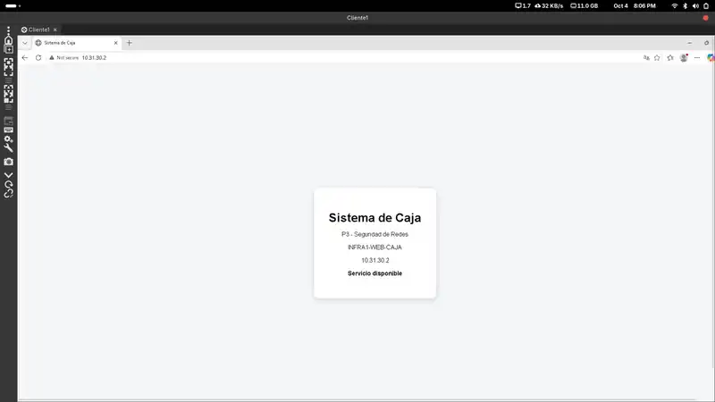

#### Acceso bloqueado a WEB-INVENTARIO

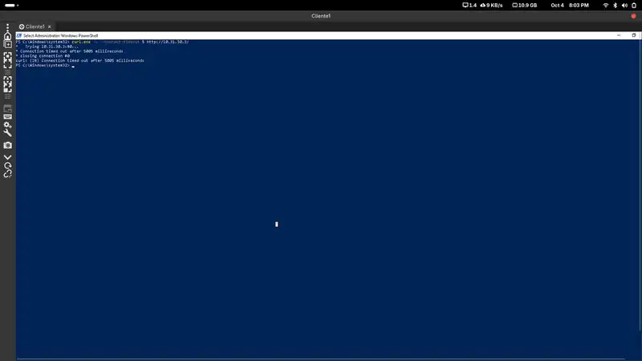

#### SSH bloqueado desde VLAN10

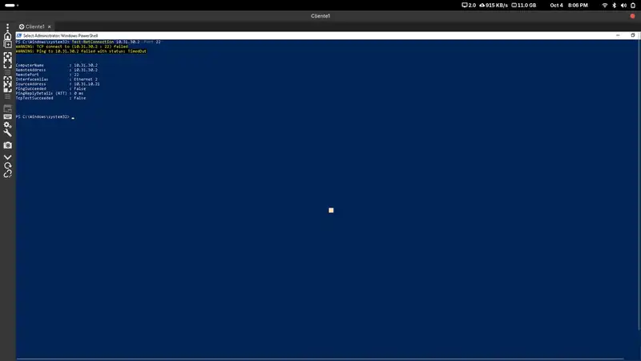

Los eventos también quedan registrados por FortiGate como **policy violation**:

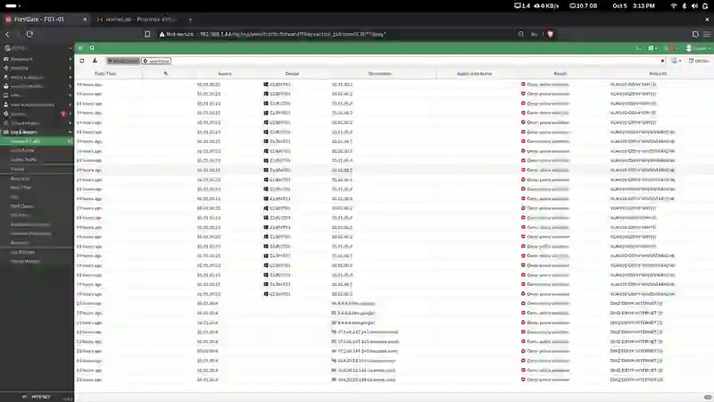

---

### VLAN20 – USERS-PRIVILEGED

Cliente de pruebas: `10.31.20.21/25`.

#### Puerto SSH permitido

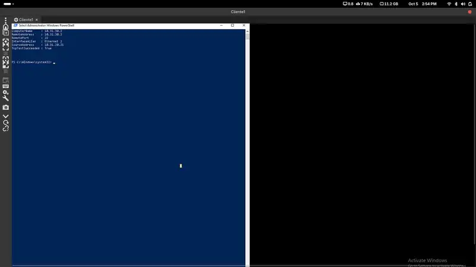

#### Sesión SSH real

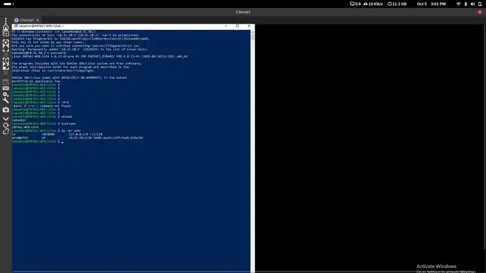

FortiGate registra el tráfico permitido mediante la política `VLAN20-ALLOW-SSH`:

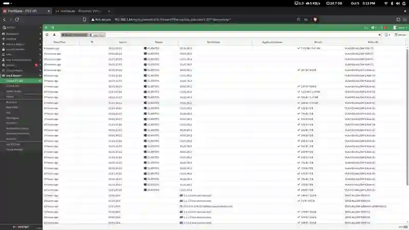

---

## 🖥️ DMZ

### Actualizaciones Debian autorizadas

El servidor DB01 puede consultar los repositorios Debian autorizados y ejecutar `apt update`.

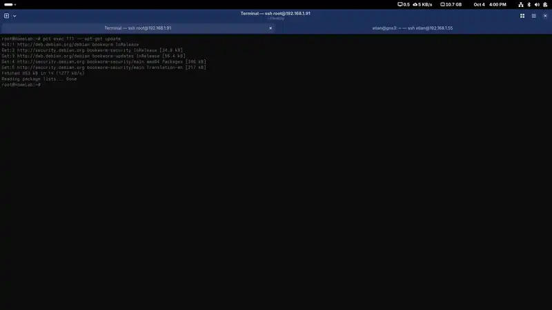

### Internet general bloqueado

Las pruebas hacia destinos no autorizados fallan según lo esperado.

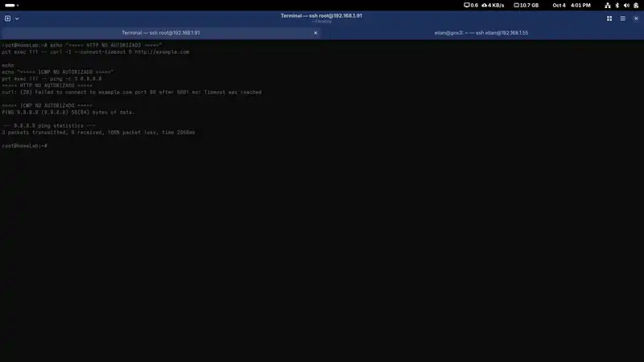

### Evidencia en logs

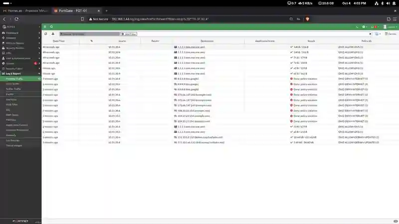

### Base de datos

DB01 ejecuta **MariaDB 10.11.18** y mantiene el servicio activo.

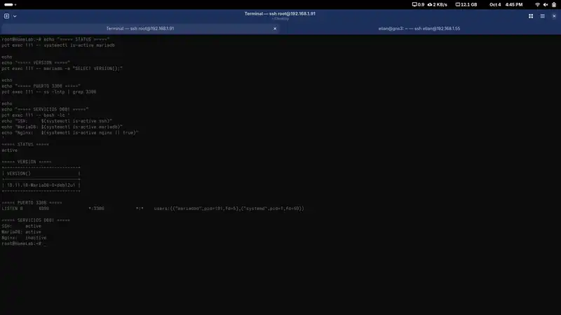

### Conectividad interna entre servidores

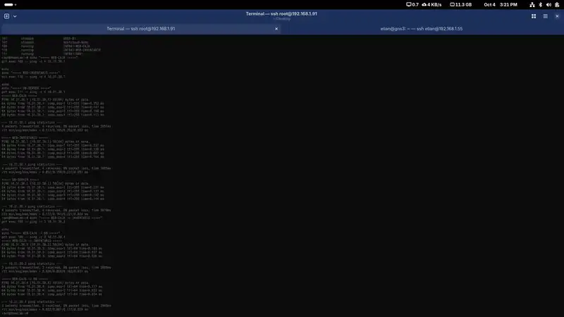

---

## 📂 Estructura del repositorio

```text
P3-Seguridad-Redes-2025-1331-Infra1/
├── README.md
├── configs/
│   └── SW-INFRA1-running-config.txt
├── diagrams/
│   └── topologia-gns3-infra1.webp
└── screenshots/
    ├── dmz/
    ├── fortigate/
    ├── switch/
    ├── vlan10/
    └── vlan20/
```

---

## ✅ Resultado

La Infraestructura 1 implementa correctamente:

- segmentación mediante VLANs;
- aislamiento de servidores en una DMZ;
- restricciones de acceso por origen y servicio;
- acceso SSH exclusivo desde VLAN20;
- acceso selectivo desde VLAN10;
- control de salida a Internet desde la DMZ;
- logging de tráfico permitido y denegado;
- hardening básico del switch.

Las pruebas documentadas y el video de demostración verifican el funcionamiento de los controles implementados.
